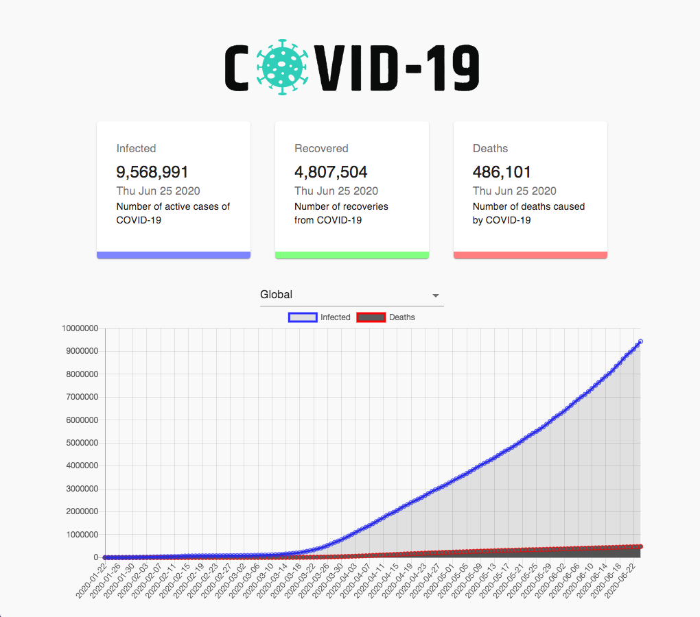

# _Covid-19 Tracker - React, Charts.js, Material UI, and API calls_

#### _This is an application for displaying worldwide and individual country statistics regarding covid-19._

#### By _**Josh Forman**_

## Description

_This application allows the users to see worldwide line graph tracking infections, recoveries, and deaths. The user can also select individual countries to see their numbers as a bar graph._

_https://github.com/JPForman/covid-tracker.git_

## Setup/Installation Requirements

* _$ git clone https://github.com/JPForman/covid-tracker.git_

* _$ cd covid-tracker_

* _$ npm install_

* _$ npm run start (browser will open to localhost:3000)_  

## Known Bugs

_Readme Endpoints need updating_  
_Needs Styling_
_Some refactoring for cleaner code_  

## Support and contact details

_Any questions, comments or contributions please contact Josh Forman (cyborgforman@gmail.com)_

## Technologies Used

_React, Material UI, Charts.js, Axios, Countup_

## Resources  
 Special thanks to the tutorial at https://www.youtube.com/watch?v=khJlrj3Y6Ls&t=3s  

### License

*The MIT License

Permission is hereby granted, free of charge, to any person obtaining a copy
of this software and associated documentation files (the "Software"), to deal
in the Software without restriction, including without limitation the rights
to use, copy, modify, merge, publish, distribute, sublicense, and/or sell
copies of the Software, and to permit persons to whom the Software is
furnished to do so, subject to the following conditions:

The above copyright notice and this permission notice shall be included in
all copies or substantial portions of the Software.

THE SOFTWARE IS PROVIDED "AS IS", WITHOUT WARRANTY OF ANY KIND, EXPRESS OR
IMPLIED, INCLUDING BUT NOT LIMITED TO THE WARRANTIES OF MERCHANTABILITY,
FITNESS FOR A PARTICULAR PURPOSE AND NONINFRINGEMENT. IN NO EVENT SHALL THE
AUTHORS OR COPYRIGHT HOLDERS BE LIABLE FOR ANY CLAIM, DAMAGES OR OTHER
LIABILITY, WHETHER IN AN ACTION OF CONTRACT, TORT OR OTHERWISE, ARISING FROM,
OUT OF OR IN CONNECTION WITH THE SOFTWARE OR THE USE OR OTHER DEALINGS IN
THE SOFTWARE.*

Copyright (c) 2020 **_Josh Forman_**